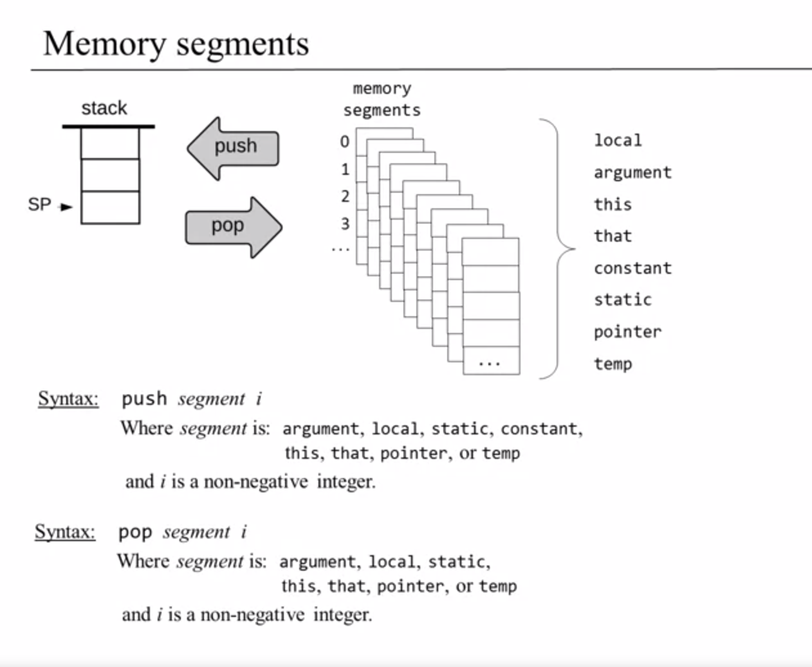
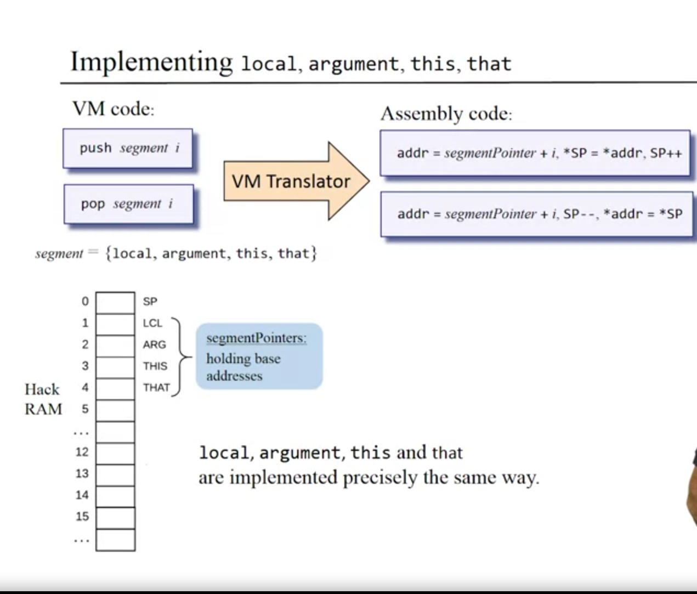
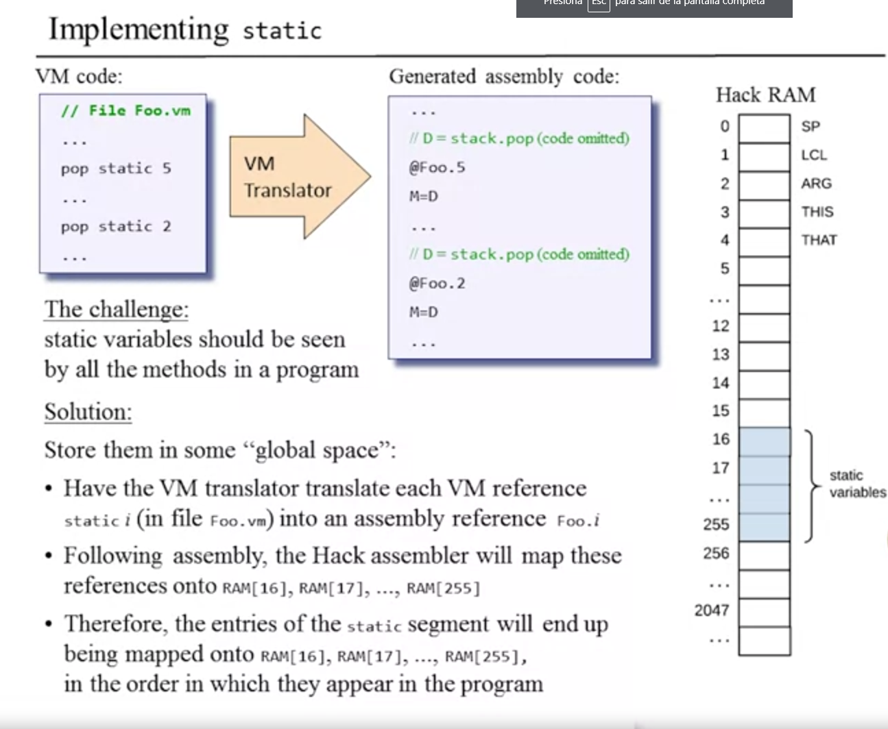
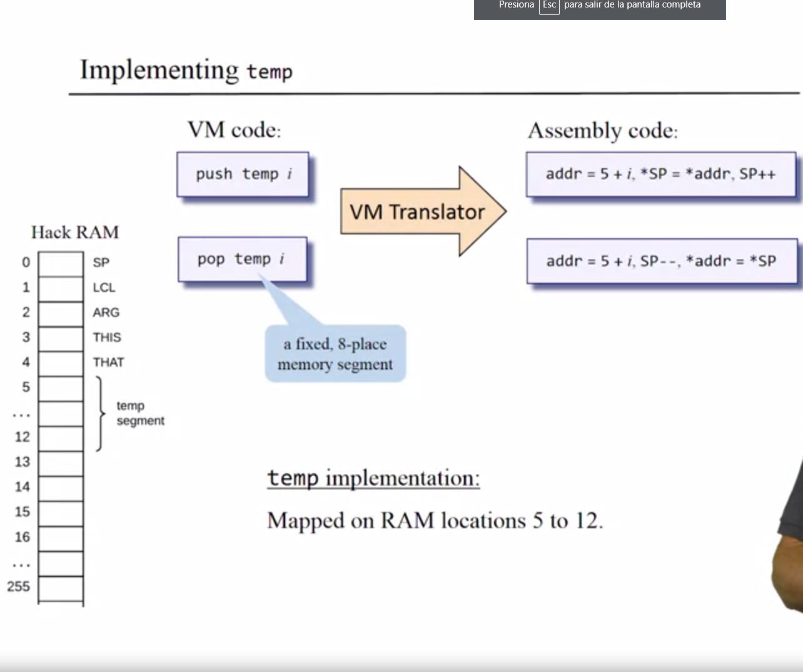
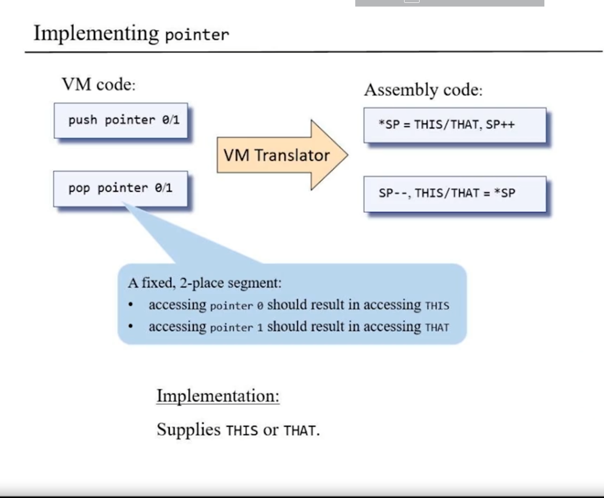

# compilation

programin in nice high level language => compiler +> programan in machine language => CPU


# Mnemonics 
instruccion: 1000010|0011|0010 => ADD instruction
              ADD   | R3 | R2

**Interpretation 1:** The "symbolic form" doesn't really exist but is just a convenient 
mmonic to present machine language instuccion to humans.

**Interpretation 2:** We will allow humans to write machine language instruction using this "assambly languages" and will have an "Assembler" program convert it to the bit-form.

# Machine Language

## Machine Operations

- Usually correnpond to what's implemented in Hardware 
    - Arithmetic Operations: add, subtract,...
    - Logical operations: and, or ,..
    - Flow Control: "goto instruction X","if C then goto instruction Y"

- Differences between machine languages
    - Richness of the set of operation(division?, bulk copy?)
    - Data types (width, floating point..)

## Memory Hierarchy 

- Accessing a memoty location is expensive
    - Need to supplu a long address 
    - Getting the memory contents into the CPU take time 

## Registers 

- CPUs usually contains a few, easily accessed, "regusters"
- Their number and functions are a central part of the machine language


## Addressin Modes 

- Register
    - Add R1,R2    //R2 <- R2+R1

- Direct 
    - Add R1, M[200]    //Mem[A] <- Mem[A] + R1

- Indirect 
    - Add R1,@A  // Mem[A] <-Mem[200] + R1

- Immediate
    - Add 73,R1 // R1 <- R1+73
 

# Working with register and memory 

```
    D: data register
    A: address / data register
    M: the current selected memoru register,M=RAM[A]
```


### Examples
```
    // D=10
    @10
    D=A

    // D++
    D=D+1

    // D=RAM[17]
    @17
    D=M

    // RAM[17]=0
    @17
    M=0

    // RAM[17]=10
    @10
    D=A
    @17
    M=D

```

### terminate a program properly
```
    @0
    D+M

    @1
    D=D+M

    @2
    M=D


    @6
    0;JMP
```


## branching
The hability to evalue a boolean expresion and based in this value executes o move on to a another line of code.

### Example

```
    // Program: Singnum.asm
    // Computes: if R0>0
    //              R1=1
    //           else
    //               R1=0

0    @R0
1    D=M    // D=RAM[0]

2    @8
3    D;JGT  /// if R0>0 goto 8

4    @R1
5    M=0     // RAM[1]=0
6    @10
7    0;JMP // end for program

8   @R1
9   M=1 //R1=1

10  @10
11  0;JMP
    
```


# Virtual Machine

## stack machine 
- Stack
- Arquitecture 
- Commands

### Stack
#### stack operations
- push: Add a plate (object) at the stack's top
- pop: remove the top plate (object)

### stack machine is manipulated by: 
- Arithmetic / logical commands
- Memory segments commands 
- Branching commands
- function commands

*when use a virtual memory segment you can preserve variable semantic but we lost veriables names*

## Memory segments




## implementing *local,argument,this,that*


## implementing *static*



## implementing *temp*


## implementing *pointer*


# Program control

### branching commands
- goto *label*
- if-goto *label*
- label *label*

### Function commands
- call *function*
- function *function*
- return *function*


## VM branching commands
- *goto* label //jump to execute the command just after label
- *if-goto* label // cond =pop; if cond jump to execute the command just after label 
- *label* label // label declaration command

## The Function's state

#### During run-time 
- Each function uses a working stack + memory segments
- The working stack and some of the segments should be:
    - Created when the function starts running
    - Maintained as long as the function is executing,
    - Recycled when the funcion returns


# Booting

## VM programming convention
One file in any VM program is expected to be named *Main.vm*; one VM function
in this file is expected to be named *main*

## VM implementation convention
When the VM implementation starts running, or is reset, it starts executing the argument-less OS funciont *Sys.init*

*Sys.init* the calls *Main.main*, and enters an infinite loop


## Hardware platform convention

#### Bootstrap code 

```
// Bootstrap code (should be written in assembly)

SP=256
Call Sys.init
```

# Special symbols in VM programs

| Symbol      | Usage |
| ----------- | ----------- |
| SP      | This predefined symbol points to the memory address within the host RAM just followig the address containing the topmost stack value       |
| LCL,ARG,THIS,THAT   | These predefinied symbols point, respectively, to the base addresses within the host RAM of the virtual segments, *local* ,*argumen* ,*this* and *that* of the currently running VM function.      |
|R13-R15|These predefined sysbols can be used for any purpose|
|Xxx.i symbols|Each static variable *i* in file *Xxx.vm* is translated into the assembly sumbol *Xxx.j*, where *j* is incremented each time a new static variable is encountered in the file *Xxx.vm*. In the subsequent assembly process, these symbolic variablers will be allocated to the RAM by the Hack assembler.|
|*functionName $label*| let *foo* be a function within a VM file *Xxx*. Each *label bar* commadn within *foo* shold generate and insert int o the assebly code stream a symbo *Xxx.foo$bar*.When translating *goto bar* and *if-goto bar* command (within *foo*) into assembly, the full label specificacion *Xxx.foo$bar* must be used instead of *bar*|
|*functionName*|Each *function foo* command within a VM file **Xxx** should genereate and insert into the assembly code stream a symbol **Xxx.foo** that labels the entry point to the function's code In the subsequent assembly process, the assembler woll translate this symbol into the physical memory address where the function code starts.|
|*functionName* $ret.i|let **foo** be a functions within a VM file **Xxx**. Within **foo**, each functions **call** command should generate and insert into the assembly code stream a symbol *Xxx.foo$ret.i*, where *i* is a running integer (one such symbol should be generated for each **call** command within **foo**). This Symbol serves as the return address to the calling funcion, In the sebseqyent assebly process, the assembler will translate this symbol into the physical memory address of the command inmmediately after the funtion call command.|